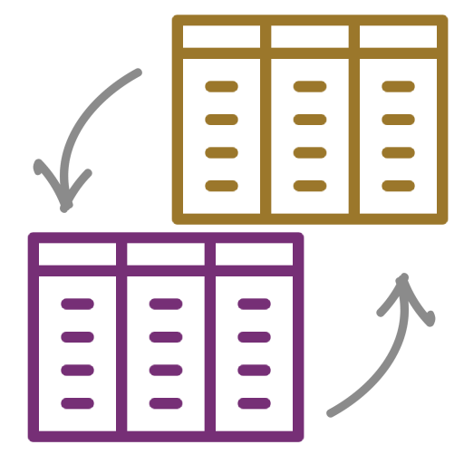

+++
title = "DF Interchange"
description = "Seamless interoperability between Polars and Arrow in Rust"
weight = 1
template = "page.html"

[taxonomies]
tags = ["data science", "rust", "arrow", "polars"]

[extra]
local_image = "img/df_interchange.png"
+++

This crate allows for seamless interoperability between any version of [Polars (>=0.40)](https://docs.rs/polars/latest/polars/) and any version of [Arrow (>=50)](https://docs.rs/arrow/latest/arrow/), including between versions of the same crate (e.g. `Polars 0.40` to `Polars 0.46`), using the [Arrow C Data Interchange](https://arrow.apache.org/docs/format/CDataInterface.html) format.

<a href="https://github.com/EricFecteau/dcss-api">  </a>

#### [Source](https://github.com/EricFecteau/df-interchange) | [Crates.io](https://crates.io/crates/df-interchange) | [Docs](https://docs.rs/df-interchange/latest/df_interchange/) {.centered-text}

Supported versions:
* Arrow: "50", "51", "52", "53", "54"
* Polars: "0.40", "0.41", "0.42", "0.43", "0.44", "0.45", "0.46"  


## Polars and Arrow Rust ecosystem

Since both `Polars` (pre-1.0) and `Arrow` have SemVer breaking API updates in Rust every few months, the Rust ecosystem that depend on these crates update at a different rates and are consistently incompatible with each other (e.g. one crate outputs `Polars 0.45` and another crate takes `Polars 0.43` as input). For crates who take these as input or provide these as output, updating should be considered an API break, and require a major bump in version. This has a cascading effect over the whole ecosystem.

For example, attempting to pass `Polars 0.45` to a crate that uses `Polars 0.43`, or vice versa, will give a [error[E0308]: mismatched types](https://doc.rust-lang.org/error_codes/E0308.html) error with the note "'DataFrame' and 'DataFrame' have similar names, but are actually distinct types". 

This crate is meant to solve the interoperability issue and prevent the need for the entirety of the ecosystem to update at the same speed.

## Usage

Enable the correct feature (e.g. `Polars 0.43`, `Polars 0.46` and `Arrow 54`):

```toml
[dependencies]
polars = "0.43"
arrow = "54"
df-interchange = { version = "0.1.0", features = ["polars_0_43", "polars_0_46", "arrow_54"] }
```

Then use the `from_polars_0_43` & `from_arrow_54` and `to_polars_0_46` implementation of `Interchange` to change types:

```Rust
use std::sync::Arc; 
use arrow::{array::{ArrayRef, Int32Array, Int64Array}, record_batch::RecordBatch}; // Arrow 54
use polars::prelude::*; // Polars 0.43
use df_interchange::Interchange;

// Create Polars 0.43 data
let polars_0_43 = DataFrame::new(vec![
    Series::new("test_i32".into(), [-1i32, 0, 1]),
    Series::new("test_i64".into(), [-1i64, 0, 1]),
])
.unwrap();

// Create arrow 54 data
let arrow_54: Vec<_> = vec![RecordBatch::try_from_iter(vec![
    ("test_i32", Arc::new(Int32Array::from(vec![-1i32, 0, 1])) as ArrayRef),
    ("test_i64", Arc::new(Int64Array::from(vec![-1i64, 0, 1])) as ArrayRef),
])
.unwrap()];

// Convert Polars 0.43 to Polars 0.46
let df_polars = Interchange::from_polars_0_43(polars_0_43)?.to_polars_0_46()?;

// Convert Arrow 54 to Polars 0.46
let df_arrow = Interchange::from_arrow_54(arrow_54)?.to_polars_0_46()?;

// Compare the two DataFrames (not possible prior to conversion to Polars 0.46)
assert!(df_polars.equals_missing(&df_arrow));

```


Logo attribute: [database](https://www.flaticon.com/free-icons/database) | [arrows](https://www.flaticon.com/free-icons/arrows)